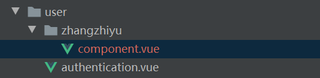

## AlphaGPT智慧社区A 前端项目

## 安装

您需要提前在本地安装[Node.js](https://nodejs.org/en/)，版本号为：[12.x、14.x]，再使用[Git](https://git-scm.com/)克隆项目或者直接下载项目后，然后通过`终端命令行`执行以下命令。

```bash
# 切换到项目根目录

# 安装插件
npm install

# 启动项目
npm run serve
```

# 开发目录
居民端：src\views\modules\user
业委会端：src\views\modules\admin

开发工具类或复用组件请在当前文件夹下创建自己名字命名的文件夹

